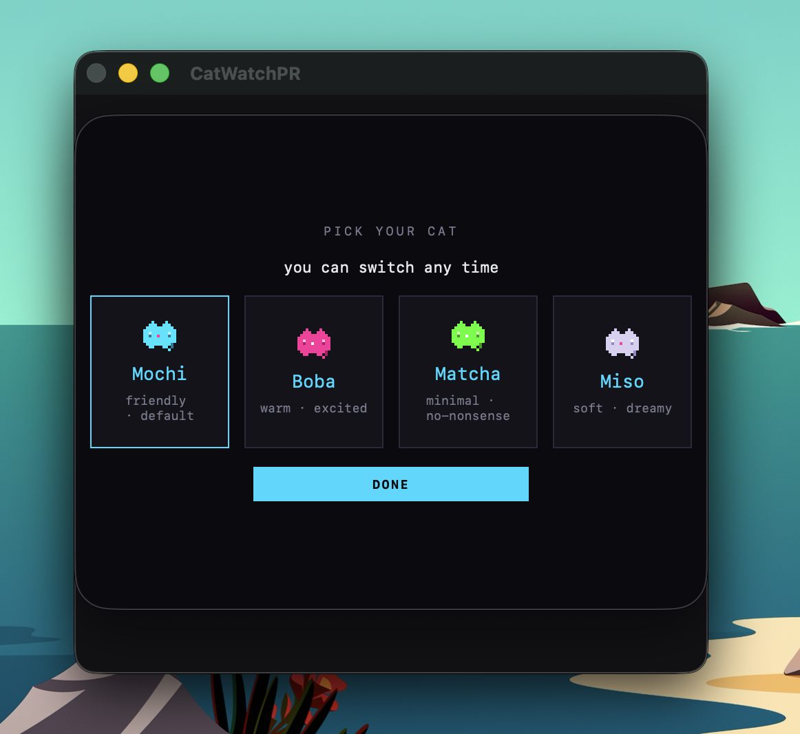

# CatWatchPR / Woo Sprinkles

A pixel cat lives in your Mac menu bar and quietly watches your GitHub pull requests for you.

- It pops up when someone comments, requests a review, or mentions you — so you're never the person who missed a notification
- When your PR gets merged, it throws confetti
- The cat only shows up when something needs your attention, then disappears — no noise, no constant pinging. Your notifications wait quietly in the menu bar whenever you're ready

| | | |
|---|---|---|
|  |  |  |

> **Download note:** public DMG downloads are paused until CatWatchPR has an Apple-signed, notarized release. If you are helping test it right now, use the source install below.

---

## What it does

- **Pops up** when someone comments on your PR, requests a review, or mentions you
- **Celebrates** with confetti when a PR gets merged
- **Lives in your menu bar** as a pixel cat face — click to see pending notifications
- **Lets you switch cats** depending on your mood

## The cats



| Name | Color | Personality |
|------|-------|-------------|
| Mochi | cyan | friendly, default |
| Boba | pink | warm and excited |
| Matcha | lime | minimal, no-nonsense |
| Miso | ghost / pale purple | soft and dreamy |

---

## Requirements

- macOS 13+
- GitHub account
- GitHub CLI (`gh`) logged in to `github.com`
- Xcode Command Line Tools, only for the temporary source install

---

## Install

### Temporary tester install

Until the public DMG is signed and notarized, install from source:

```bash
git clone https://github.com/annchichi/catwatchpr.git
cd catwatchpr
bash build_app.sh --install
open /Applications/CatWatchPR.app
```

A small wizard then walks you through:

1. **Welcome**
2. **GitHub auth check** — if you're not logged into `gh`, it copies the right command to your clipboard
3. **Install** — sets up three background agents (watch, sync, menu bar)
4. **Pick your cat** — Mochi, Boba, Matcha, or Miso

That's it. The cat is now in your menu bar, watching your PRs.

### Public DMG releases

The DMG is only for public sharing after it passes Apple signing and notarization:

```bash
CATWATCHPR_SIGN_IDENTITY="Developer ID Application: Your Name (TEAMID)" \
CATWATCHPR_NOTARY_PROFILE="catwatchpr-notary" \
bash build_app.sh --release
```

If those credentials are missing, the release build fails before packaging. This prevents another DMG that downloads successfully but macOS refuses to open.

---

## Usage

Click the cat in your menu bar to see pending notifications or switch cats.

Open `CatWatchPR.app` again any time to get the **control panel** — status, *Restart all*, *Activity* logs, switch cat, or remove the app.

---

## Customise

From the control panel (open `CatWatchPR.app`):

- **Switch cat** — Mochi, Boba, Matcha, Miso
- **Restart all** — restart the three background agents
- **Remove** — soft uninstall (your config is kept)
- **Reset everything** — wipe state and start over

---

## Built with

- Swift + AppKit — pixel cat rendering, animations, spring physics
- Bash — GitHub CLI polling, launchd scheduling
- Claude — AI pair that turned the idea into working code

---

*Made by a designer who missed her PR pings once too often.*
